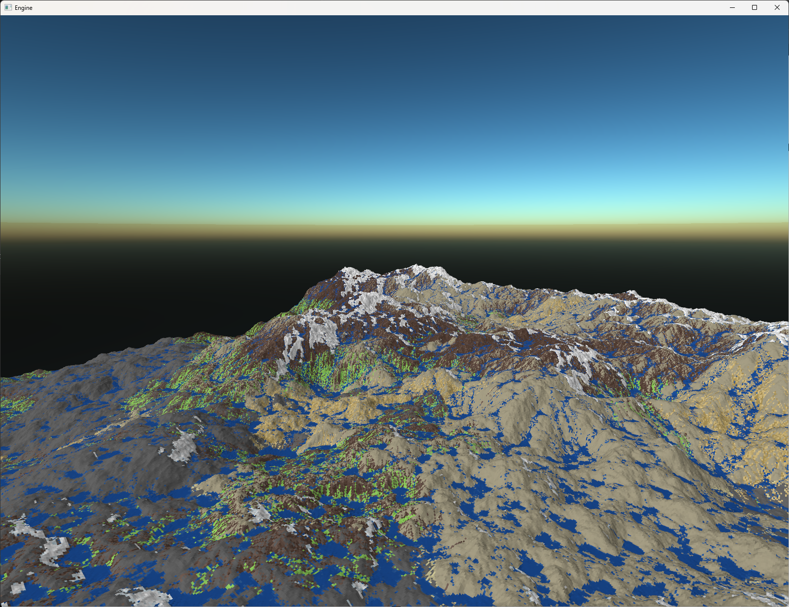
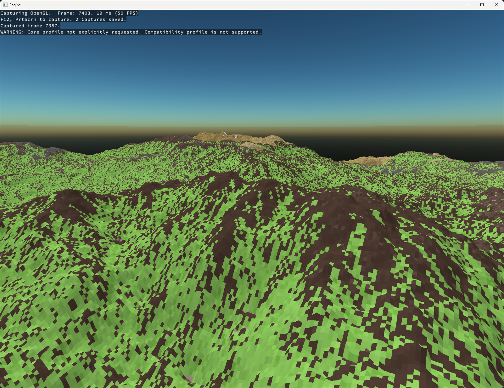

# Geo-Logik
## Erosion Simulation

Geo-Logik simulates erosion on procedurally generated terrain.

Hydralic Erosion under consideration of different simulated environment factors like:
- temperature w/ sun movement & seasonal differences
- rain & snow
- melting and evaporation

<a></a>
<br>
<a></a>
<br>

## Keyboard Inputs

You can use different inputs whilst the application is running:

- `p` - rain / snowfall
- `m` - melt snow
- `t` - faster erosion
- `LShift + F10` - Write the current terrain to file
- `w`, `a`, `s`, `d`, `e`, `x`, (+ `LShift`) - camera movement

## How to run the application
You need CMake installed.

- Create a `builds` folder in the project root folder
- From the `builds` folder in command line run `cmake ..` to generate a `.sln` file
- Open the solution file in Visual Studio
- Start the application.

### How to load terrain from file
- Enter the filename as command line parameter.

### How to save terrain to a file
- Press `LShift + F10` whilst the appilcation is running.
- Find the file in the `builds` folder as `out_terrain.bin`

#### Specification for the shared file format

```
// all data is written to the file raw -> this is a binary data format.

uint8_t version = 1; // for now this is 1, but may be incremented in the furure if we ever decide to change anything about the file format.
uint16_t width;
uint16_t height;

tile data[width * height];

// the data contain the following information for each 'tile':

struct tile
{
  uint16_t layers[8] { // all the heights are in decimeters (sry).
    snowHeight, 
    waterHeight, 
    grassHeight, 
    soilHeight, 
    sandHeight, 
    limeStoneHeight, 
    stoneHeight, 
    bedrockHeight // cannot be carried away by erosion 
  };
  
  // within the 'world' the terrain types can only ever be layered in the exact same order as in the array. So snow is always on top, then follows water, ..., with bedrock as the last layer.
}
```
